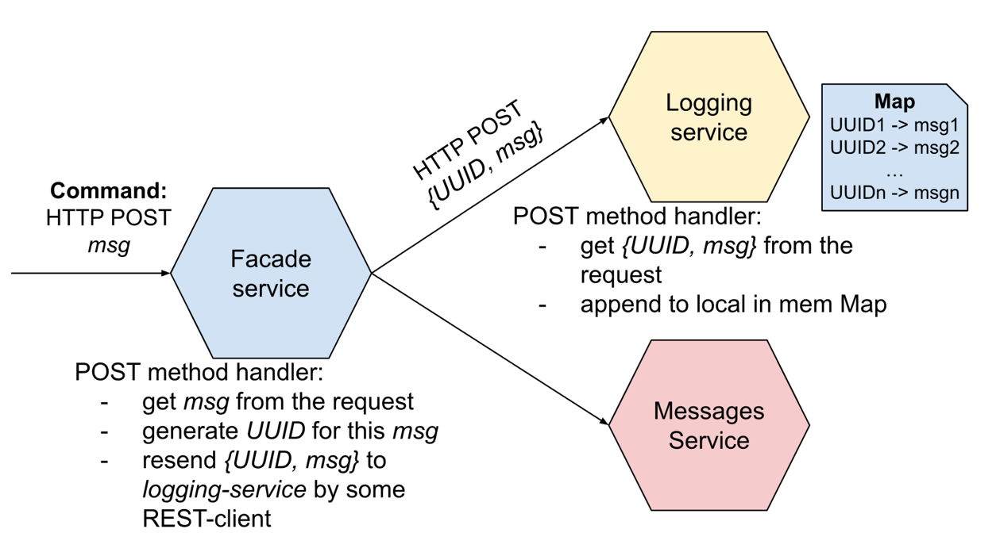
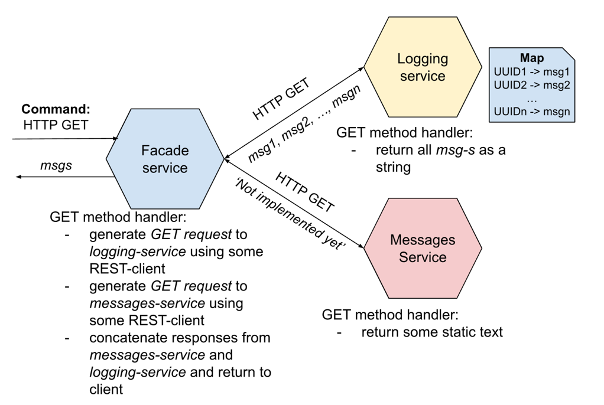
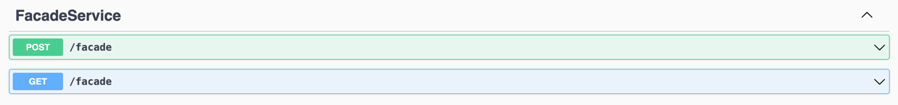
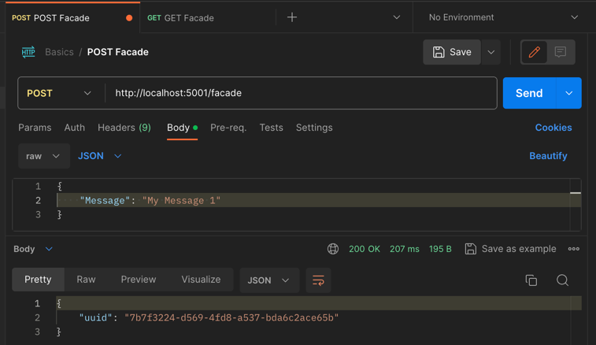
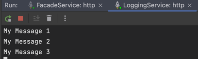
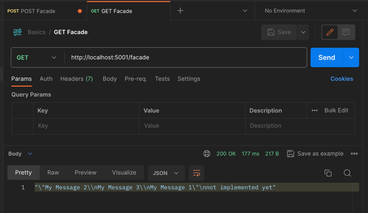

# Task 1 - Basic microservice architecture
### Framework: C# Minimal Web API

Author: [Tymur Krasnianskyi](https://github.com/trlumph/)

## HTTP POST request workflow

## HTTP GET request flow

## Swagger Support
The Swagger UI is available at the `/swagger` endpoint. It provides a convenient way to test the API.

## CI/CD 
The project is set up with GitHub Actions to automatically build and test the project on every push to the `master` and/or `micro_basics` branches.

## Examples:
Sending some messages: (Repeat a few times to get more messages)\

LoggingService output:\

Getting all messages:\
