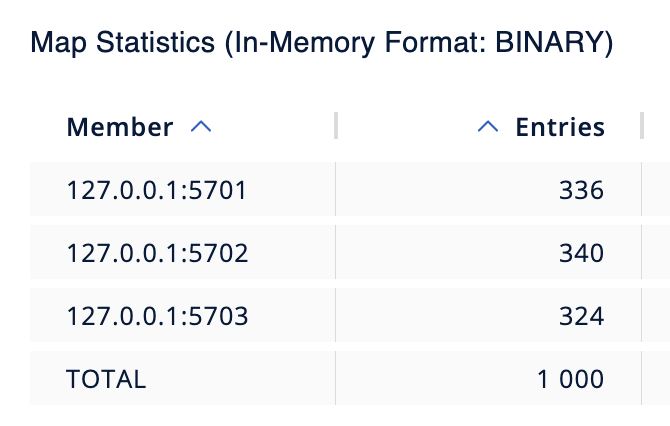
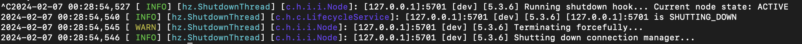
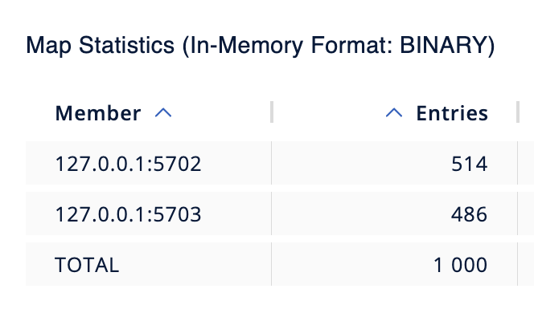
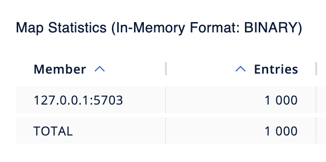
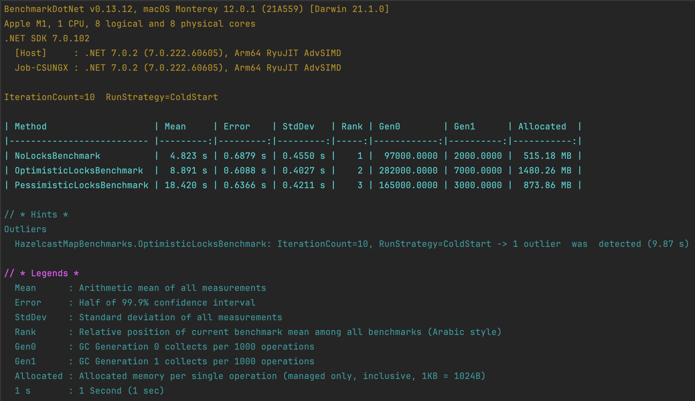
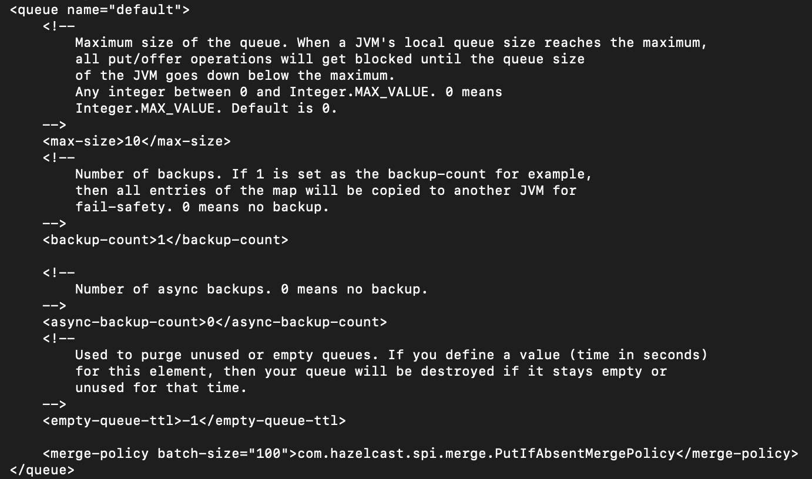
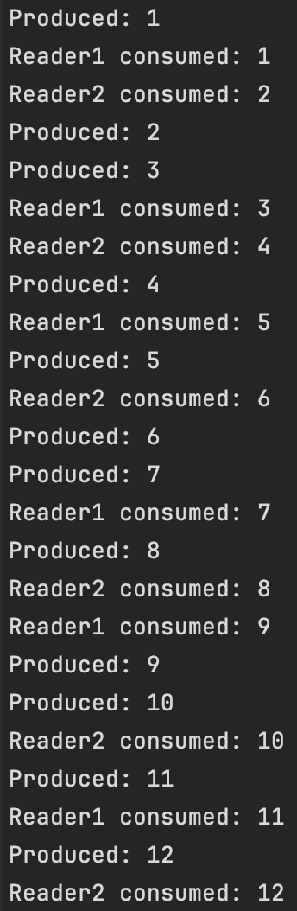
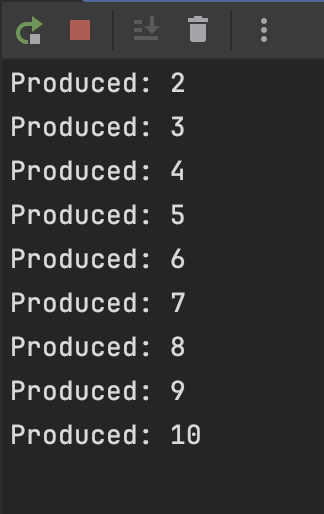

# Task 2 - Hazelcast Basics
### Framework: C# .NET 7.0

Author: [Tymur Krasnianskyi](https://github.com/trlumph/)

## 1: Install Hazelcast (OSX)
```bash
brew install hazelcast@5.3.6
brew install hazelcast-management-center@5.3.3
```

## 2: Starting a Hazelcast Cluster
```bash
hz-start
```


## 3: Distributed Map
```csharp
private static async Task DistributedMapExample(IHazelcastClient hz)
{
    // Get or Create a Distributed Map
    var map = await hz.GetMapAsync<int, string>("my-distributed-map");

    // Populate the map with 1000 entries
    for (var i = 0; i < 1000; i++)
    {
        await map.SetAsync(i, $"Value {i}");
    }

    Console.WriteLine("1000 entries added to the Distributed Map");
}
```

### Disabling Node 1:



### Disabling Node 2:




*Note: No data loss after disabling nodes.*

## 4: Distributed Map
### - No Locks
```csharp
public static async Task<int> NoLocks(IHMap<string,int> map)
{
    await map.PutAsync("key", 0);

    var tasks = new List<Task>();

    for (var i = 0; i < 3; i++)
    {
        var task = Task.Run(async () =>
        {
            for (var k = 0; k < 10_000; k++)
            {
                var currentValue = await map.GetAsync("key");
                currentValue++;
                await map.PutAsync("key", currentValue);
            }
        });
        tasks.Add(task);
    }

    await Task.WhenAll(tasks);

    return await map.GetAsync("key");
}
```
Results:  

| Run # | Final Value Without Locks |
|-------|---------------------------|
| 1     | 13854                     |
| 2     | 13950                     |
| 3     | 14118                     |
| 4     | 14017                     |
| 5     | 13846                     |

*Note: The final value is different each time meaning a data race present.*

### - With Pessimistic Locks
```csharp
public static async Task<int> PessimisticLocks(IHMap<string,int> map)
{
    await map.PutAsync("key", 0);
    
    var tasks = new List<Task>();

    for (var i = 0; i < 3; i++)
    {
        using (AsyncContext.New())
        {
            var task = Task.Run(async () =>
            {
                for (var k = 0; k < 10_000; k++)
                {
                    await map.LockAsync("key");
                    
                    try
                    {
                        var value = await map.GetAsync("key");
                        value++;
                        await map.PutAsync("key", value);
                    }
                    finally
                    {
                        await map.UnlockAsync("key");
                    }
                }
            });

            tasks.Add(task);
        }
    }
    
    await Task.WhenAll(tasks);        

    return await map.GetAsync("key");
}
```
Results: All runs return the same final value of 30,000.

### - With Optimistic Locks
```csharp
public static async Task<int> OptimisticLocks(IHMap<string,int> map)
{
    await map.PutAsync("key", 0);
    
    var tasks = new List<Task>();

    for (var i = 0; i < 3; i++)
    {
        var task = Task.Run(async () =>
        {
            for (var k = 0; k < 10_000; k++)
            {
                var success = false;
                while (!success)
                {
                    var oldValue = await map.GetAsync("key");
                    var newValue = oldValue + 1;
                    success = await map.ReplaceAsync("key", oldValue, newValue);
                }
            }
        });

        tasks.Add(task);
    }

    await Task.WhenAll(tasks);        

    return await map.GetAsync("key");
}
```
Results: All runs return the same final value of 30,000.

### Bonus: Unit Tests (XUnit)
First, install the XUnit package:
```bash
dotnet add package xunit
```
Then, run the tests:
```bash
dotnet test
```


### Bonus: Performance Benchmarks
First, install the BenchmarkDotNet package:
```bash
dotnet add package BenchmarkDotNet
```
Then, run the benchmarks:
```bash
dotnet run -c Release
```



Notes:
- Without locks the performance is best, but the final value is not guaranteed to be correct.
- Optimistic locks are x2 faster than pessimistic locks, but they allocate twice as much memory on the heap.

## 5: Bounded Queue
### - Setup
Update the configuration file `hazelcast.xml`.
Pay attention to the `max-size` section:



### - Producer-Consumer
With 1 producer and 2 consumers a pattern can be observed:
Each reader gets every second message from the producer.


| Consumer | 1             | 2              |
|----------|---------------|----------------|
| Messages | 1 3 5 7 9 ... | 2 4 6 8 10 ... |




### - Solo Writer
When the queue is full, the producer will wait until the consumer reads the queue.



