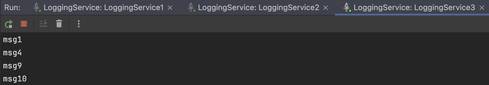

# Task 4 - Hazelcast Message Queue
### Framework: Minimal API C# .NET 7.0

Author: [Tymur Krasnianskyi](https://github.com/trlumph/)

## 1: Install Hazelcast (OSX)
```bash
brew install hazelcast@5.3.6
brew install hazelcast-management-center@5.3.3
```

## 2: Starting a Hazelcast Cluster
```bash
hz-start
```


## 3: Logging Service
Update the `launchSettings.json` file to include the following environment variables:
- `applicationUrl` - the URL of the service
- `HAZELCAST_NODE` - the address of the Hazelcast node

```json
{
  "profiles": {
    "LoggingService1": {
      "commandName": "Project",
      "launchBrowser": false,
      "applicationUrl": "http://localhost:5064",
      "environmentVariables": {
        "ASPNETCORE_ENVIRONMENT": "Development",
        "HAZELCAST_NODE": "localhost:5701"
      }
    },
    "LoggingService2": {
      "commandName": "Project",
      "launchBrowser": false,
      "applicationUrl": "http://localhost:5065",
      "environmentVariables": {
        "ASPNETCORE_ENVIRONMENT": "Development",
        "HAZELCAST_NODE": "localhost:5702"
      }
    },
    "LoggingService3": {
      "commandName": "Project",
      "launchBrowser": false,
      "applicationUrl": "http://localhost:5066",
      "environmentVariables": {
        "ASPNETCORE_ENVIRONMENT": "Development",
        "HAZELCAST_NODE": "localhost:5703"
      }
    }
  }
}
```
## 4: Messages Service
Update the `launchSettings.json` file to include the following environment variables:
- `applicationUrl` - the URL of the service
```json
{
  "profiles": {
    "MessagesService1": {
      "commandName": "Project",
      "launchBrowser": false,
      "applicationUrl": "http://localhost:5074",
      "environmentVariables": {
        "ASPNETCORE_ENVIRONMENT": "Development",
        "HAZELCAST_NODE": "localhost:5701"
      }
    },
    "MessagesService2": {
      "commandName": "Project",
      "launchBrowser": false,
      "applicationUrl": "http://localhost:5075",
      "environmentVariables": {
        "ASPNETCORE_ENVIRONMENT": "Development",
        "HAZELCAST_NODE": "localhost:5702"
      }
    }
  }
}

```
## 5: Running the Services


## 6: Testing the Services
### Post 10 messages


Logging Services:




Messages Services:


### Get all messages
*Note: The result format is "`LoggingServiceMessages\nMessagesServiceMessages`"*

From MessagesService 1:


From MessagesService 2:


### Shutdown some of the logging nodes


The messages are still available in the cluster.


The messages are still available in the cluster.


