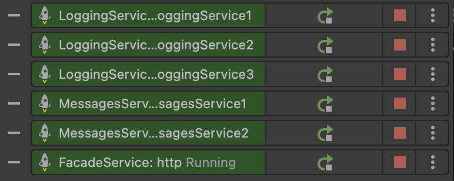
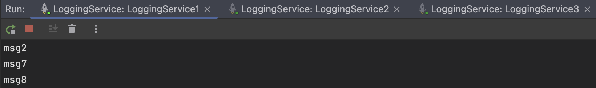
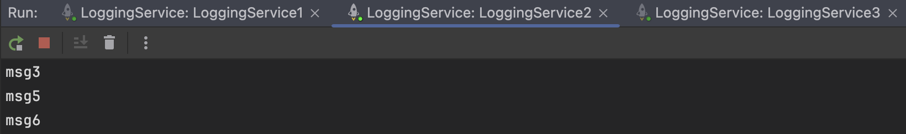
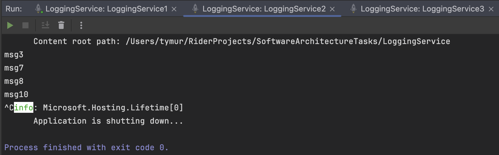

# Task 5 - Microservices: Service Discovery and Config Server using Consul
### Framework: Minimal API C# .NET 7.0

Author: [Tymur Krasnianskyi](https://github.com/trlumph/)

## 1: Install Hazelcast (OSX)
```bash
brew install hazelcast@5.3.6
brew install hazelcast-management-center@5.3.3
```

## 2: Starting a Hazelcast Cluster
```bash
hz-start
```


## 3: Logging Service
Update the `launchSettings.json` file to include the following environment variables:
- `ASPNETCORE_URLS` - the URL of the service

*Note: `HAZELCAST_NODE` parameter is removed.*

```json
{
  "profiles": {
    "LoggingService1": {
      "commandName": "Project",
      "launchBrowser": false,
      "applicationUrl": "http://localhost:5064",
      "environmentVariables": {
        "ASPNETCORE_ENVIRONMENT": "Development",
        "ASPNETCORE_URLS": "http://localhost:5064"
      }
    },
    "LoggingService2": {
      "commandName": "Project",
      "launchBrowser": false,
      "environmentVariables": {
        "ASPNETCORE_ENVIRONMENT": "Development",
        "ASPNETCORE_URLS": "http://localhost:5065"
      }
    },
    "LoggingService3": {
      "commandName": "Project",
      "launchBrowser": false,
      "environmentVariables": {
        "ASPNETCORE_ENVIRONMENT": "Development",
        "ASPNETCORE_URLS": "http://localhost:5066"
      }
    }
  }
}
```

In the `appsettings.json` file, add the following configuration:
- `ConsulConfig` - the URL of the Consul server
- `HazelcastConfig` - the key of the Hazelcast nodes configuration in the Consul registry.
```json
{
  "ConsulConfig": {
    "Host": "http://localhost:8500"
  },
  "HazelcastConfig": {
    "NodesKey": "hazelcast/config/nodes"
  }
}
```
## 4: Messages Service
Update the `launchSettings.json` file to include the following environment variables:
- `ASPNETCORE_URLS` - the URL of the service

*Note: `HAZELCAST_NODE` parameter is removed.*

```json
{
  "profiles": {
    "MessagesService1": {
      "commandName": "Project",
      "launchBrowser": false,
      "environmentVariables": {
        "ASPNETCORE_ENVIRONMENT": "Development",
        "ASPNETCORE_URLS": "http://localhost:5074"
      }
    },
    "MessagesService2": {
      "commandName": "Project",
      "launchBrowser": false,
      "environmentVariables": {
        "ASPNETCORE_ENVIRONMENT": "Development",
        "ASPNETCORE_URLS": "http://localhost:5075"
      }
    }
  }
}
```

In the `appsettings.json` file, add the following configuration:
- `ConsulConfig` - the URL of the Consul server
- `HazelcastConfig` - the key of the Hazelcast nodes configuration in the Consul registry.
```json
{
  "ConsulConfig": {
    "Host": "http://localhost:8500"
  },
  "HazelcastConfig": {
    "NodesKey": "hazelcast/config/nodes",
    "MQNameKey": "hazelcast/config/mq/name"
  }
}
```

### Reading messages from the queue
```csharp
var listeningTask = messagesService.StartListening(backgroundTaskCTS.Token);
```

The class must implement the `IMessagesManager` interface.
```csharp
public interface IMessagesManager
{
    Task StartListening(CancellationToken cancellationToken);
    Task<List<string>> GetAllMessagesAsync();
}
```

The proposed implementation of the `IMessagesManager` interface is as follows:
```csharp
public class MessagesManager : IMessagesManager
{
    private readonly IHazelcastClient _hzClient;
    private readonly List<string> _messages = new();
    private readonly MessageQueueConfigurationService _messageQueueConfigService;

    public MessagesManager(IHazelcastClient hzClient, MessageQueueConfigurationService messageQueueConfigService)
    {
        _hzClient = hzClient;
        _messageQueueConfigService = messageQueueConfigService;
    }

    public async Task StartListening(CancellationToken cancellationToken)
    {
        var queueName = await _messageQueueConfigService.GetMQNameAsync();
        var queue = await _hzClient.GetQueueAsync<string>(queueName);
        
        while (!cancellationToken.IsCancellationRequested)
        {
            // Blocks until a message is available
            var message = await queue.TakeAsync();
            if (message is not null)
            {
                _messages.Add(message);
                Console.WriteLine($"Message received and processed: {message}");
            }
        }
    }

    public Task<List<string>> GetAllMessagesAsync()
    {
        return Task.FromResult(_messages);
    }
}
```


## 5. Facade Service
Update the `launchSettings.json` file to include the following environment variables:
- `ASPNETCORE_URLS` - the URL of the service

```json
{
  "profiles": {
    "FacadeService1": {
      "commandName": "Project",
      "dotnetRunMessages": true,
      "launchBrowser": false,
      "environmentVariables": {
        "ASPNETCORE_ENVIRONMENT": "Development",
        "ASPNETCORE_URLS": "http://localhost:5000"
      }
    },
    "FacadeService2": {
      "commandName": "Project",
      "dotnetRunMessages": true,
      "launchBrowser": false,
      "environmentVariables": {
        "ASPNETCORE_ENVIRONMENT": "Development",
        "ASPNETCORE_URLS": "http://localhost:5001"
      }
    }
  }
}
```

In the `appsettings.json` file, add the following configuration:
- `ConsulConfig` - the URL of the Consul server
- `HazelcastConfig` - the key of the Hazelcast nodes configuration in the Consul registry.

```json
{
  "ConsulConfig": {
    "Host": "http://localhost:8500"
  },
  "HazelcastConfig": {
    "NodesKey": "hazelcast/config/nodes",
    "MQNameKey": "hazelcast/config/mq/name"
  }
}
```

### Adding the message queue name to the consul key-value store 


### Pushing messages to the queue and logging
*Note: The logging service is discovered using the Consul service discovery.*
```csharp
app.MapPost("/facade", async (
    MessageRequest? request,
    IHazelcastClient hzClient,
    IHttpClientFactory httpClientFactory,
    MessageQueueConfigurationService mqConfigService) =>
{
    if (request is null) 
        return Results.BadRequest("Message is required");

    var queueName = await mqConfigService.GetMQNameAsync();
    var queue = await hzClient.GetQueueAsync<string>(queueName);
    await queue.OfferAsync(request.Message);

    var loggingServiceUri = await DiscoveryService.DiscoverServiceUri(consulClient, "logging-service");
    var client = httpClientFactory.CreateClient();
    var uuid = Guid.NewGuid().ToString();
    await client.PostAsJsonAsync(loggingServiceUri+"log", new { Uuid = uuid, request.Message });
    return Results.Ok(new { Uuid = uuid });
});
```

## Registering services in Consul
1. Add the `ConsulRegistrationManager` singleton.
    ```csharp
    services.AddSingleton<ConsulRegistrationManager>();
    ```

2. Register the service in consul.
    ```csharp
    var consulManager = app.Services.GetRequiredService<ConsulRegistrationManager>();
    await consulManager.Register(consulClient, serviceName, serviceId, servicePort);
    ```
   
## Deregistering services in Consul
To make sure that the services are deregistered from Consul when the application is stopped or in case of an error add the following:
```csharp
app.Lifetime.ApplicationStopping.Register(async () =>
{
    await consulManager.Deregister(consulClient, serviceId);
    await hzClient.DisposeAsync();
});

AppDomain.CurrentDomain.UnhandledException += async (sender, eventArgs) =>
{
    Console.WriteLine("Unhandled exception occurred. Deregistering service...");
    await consulManager.Deregister(consulClient, serviceId);
};
```

## Excluding the explicit registration of the services
```csharp
// serviceCollection.AddHttpClient("LoggingService1", client => client.BaseAddress = new Uri("http://localhost:5064/"));
// serviceCollection.AddHttpClient("LoggingService2", client => client.BaseAddress = new Uri("http://localhost:5065/"));
// serviceCollection.AddHttpClient("LoggingService3", client => client.BaseAddress = new Uri("http://localhost:5066/"));
// serviceCollection.AddHttpClient("MessagesService1", client => client.BaseAddress = new Uri("http://localhost:5074/"));
// serviceCollection.AddHttpClient("MessagesService2", client => client.BaseAddress = new Uri("http://localhost:5075/"));
```


## Application Workflow


## Running the Services
### Running the consul server




## Testing the Services
### Post 10 messages


Logging Services:





Messages Services:


### Get all messages
*Note: The result format is "`LoggingServiceMessages\nMessagesServiceMessages`"*

From MessagesService 1:


From MessagesService 2:


### Shutdown some of the logging nodes


The messages are still available in the cluster.




The messages are still available in the cluster.


